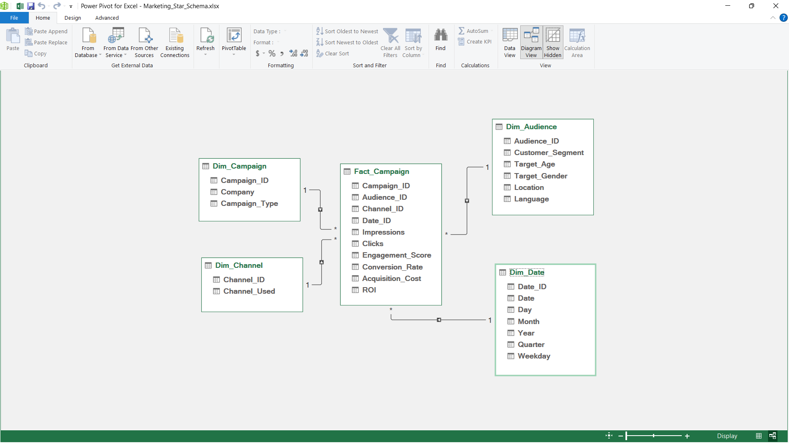

# Marketing Campaign Analytics Project

---

## Introduction (Problem-Driven)

Marketing data is often fragmented, inconsistent, and not immediately usable for decision-making.

This project addresses a core business challenge:

> **How can raw campaign data be transformed into a structured analytical system that enables performance evaluation and strategic decision-making?**

---

## Business Understanding

Marketing teams require:

- Clear visibility into campaign performance  
- Audience segmentation insights  
- ROI-driven decision-making  

However, raw datasets typically lack:

- Structure  
- Consistency  
- Analytical readiness  

✔ This project transforms raw data into a **business-ready analytical system**.

---

## Data Cleaning & Preparation

The dataset was systematically transformed to ensure analytical usability.

### 🔹 Audience Structuring

The `Target_Audience` column was decomposed into:

- `Target_Age`  
- `Target_Gender`  

**Impact:**

- Enables granular segmentation  
- Improves dashboard filtering  

---

### 🔹 Column Reordering

Columns were reorganized into a logical analytical flow:

> **Identification → Targeting → Configuration → Metrics → Financials**

**Impact:**

- Improves readability  
- Aligns with data modeling practices  
- Enhances BI usability  

---

## Data Dictionary

A structured data dictionary was developed to standardize the dataset.

Includes:

- Column Name  
- Data Type  
- Business Description  

---

## Column Categorization (Modeling Foundation)

| Category                  | Columns                                                                 |
|--------------------------|-------------------------------------------------------------------------|
| Campaign Identification  | Campaign_ID, Company, Campaign_Type                                    |
| Audience Targeting       | Customer_Segment, Target_Age, Target_Gender, Location, Language        |
| Campaign Configuration   | Channel_Used, Duration, Date                                           |
| Engagement Metrics       | Impressions, Clicks, Engagement_Score                                  |
| Financial Metrics        | Conversion_Rate, Acquisition_Cost, ROI                                 |

---

## Data Modeling – Star Schema

To enable scalable and efficient analytics, a **Star Schema** was designed.



### Fact Table

#### `Fact_Campaign_Performance`

Central table capturing measurable business events:

- Impressions  
- Clicks  
- Engagement_Score  
- Conversion_Rate  
- Acquisition_Cost  
- ROI  

---

### Dimension Tables

- `Dim_Campaign` → Campaign details  
- `Dim_Audience` → Audience segmentation  
- `Dim_Channel` → Marketing channels  
- `Dim_Date` → Time-based analysis  

---

### Relationships

- One-to-many relationships from dimensions → fact table  
- Surrogate keys implemented for:
  - Data consistency  
  - Faster joins  
  - Scalability  

---

### Why Star Schema?

- Optimized query performance  
- Simplified dashboard development  
- Scalable for large datasets  
- Industry-standard BI architecture  

---

## Python Implementation

Using **Pandas**, the data model was programmatically built:

- Generated dimension tables  
- Constructed fact table  
- Maintained relational integrity  
- Exported all tables into a single Excel file  

---

## Dashboard – Tableau (Decision Layer)

The final stage transforms the data model into an **interactive decision-making system** using Tableau.

---

### Dashboard Objective

> Provide a unified view of campaign performance to identify:
- High-performing channels  
- Profitable audience segments  
- Inefficient cost allocations  
- Optimization opportunities  

---

### Key Metrics (KPIs)

- Impressions  
- Clicks  
- Conversion Rate  
- Acquisition Cost  
- CTR (Click-Through Rate)  
- ROI  

---

### Dashboard Structure

The dashboard is designed across multiple analytical views:

#### 1. Campaign Type Analysis


#### 2. Channel Performance


#### 3. Company-Level Performance


#### 4. Customer Segment Analysis


#### 5. Geographic Insights


#### 6. Target Age Analysis


#### 7. Target Gender Insights


#### 8. Detailed Data View


---

### Key Features

- Fully interactive filters:
  - Company  
  - Campaign Type  
  - Customer Segment  
  - Channel  
  - Location  
  - Target Audience  

- Drill-down capabilities across dimensions  
- Consistent KPI tracking across all views  
- Time-based trend analysis  

---

### Design System

- Dark theme for high contrast and readability  
- Consistent color palette for clarity  
- KPI-first layout for immediate insights  
- Minimal clutter for focused analysis  

---

## Insights & Business Value

This dashboard enables:

- Identification of high-ROI channels  
- Detection of inefficient cost allocation  
- Audience targeting optimization  
- Campaign performance benchmarking  

---

## Project Structure

```text
Marketing_Project/
│
├── 00_Data/
│   ├── Raw Data/ 
│   │   └── (Private)
│   ├── Cleaned Data/
│   │   └── Cleaned_Dataset.xlsx
│   └── Data Dictionary/
│       └── Data Dictionary.xlsx
│
├── 01_Data_Modeling/
│   ├── Entity_Relationship_Diagram/
│   │   └── ERD.png
│   ├── Final_Dataset/
│   │   └── Marketing_Dataset.xlsx
│   └── Building_a_Star_Schema.py
│
├── 02_Dashboard/
│   ├── Dashboard Snapshots
│   │   ├── Campaign Type Page.png
│   │   ├── Channel Page.png
│   │   ├── Company Page.png
│   │   ├── Customer Segment Page.png
│   │   ├── Detailed Table.png
│   │   ├── Location Page.png
│   │   ├── Target Age Page.png
│   │   └── Target Gender Page.png 
│   ├── Images
│   │   ├── Clear_Filter_Icon.png
│   │   ├── Filter_Hidden.png
│   │   ├── filter_icon.png
│   │   ├── Filter_Shown.png
│   │   ├── Image_Download_Icon.png
│   │   ├── PDF_Download_Icon.png
│   │   ├── Table_Activation_Mode.png
│   │   └── Table_Non_Activation_Mode.png
│   └── Marketing_Dashboard.twbx
│
└── README.md
```